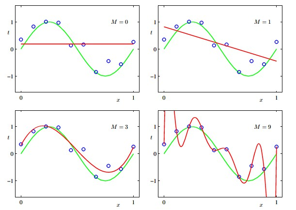
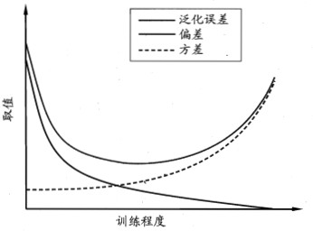

### 1.1 基本术语
给定一组关于学生的数据，例如： 

|德|智|体|
|:---:|:---:|:---:|
|60|70|50|
|80|90|85|
|75|90|86|

我们称这组数据的集合为一个**数据集**，其中每条记录是关于一个事件或者对象的描述，称为一个**示例**或**样本**，而反应事件或者对象在某方面的表现或者性质的事项，例如“德”，称为**属性**或**特征**，属性上的取值，例如60，称为**属性值**，属性张成的空间称为**属性空间**，**样本空间**或**输入空间**，例如我们可以把“德”，“智”，“体”作为三个坐标轴，那么它们可以张成一个描述学生的空间，每个学生都可以在这个空间中找到自己的坐标位置，而空间中的每个点对应于一个坐标向量，因此也可以将一个样本称为**特征向量**。

通常而言，令$D={x_{1}, x_{2}, ... , x_{m}}$为包含了$m$个样本的数据集，每个样本由$d$个属性描述（上表中为3）,则每个样本$x_{i}=(x_{i1}, x_{i2}, ... , x_{id})$是$d$维样本空间中的一个向量，$d$称为样本$x_{i}$的**维数**。

从数据中学得模型的过程称为**学习**或**训练**，训练过程使用的数据称为**训练数据**，其中每个样本称为一个**训练样本**， 训练样本组成的集合称为**训练集**。而学得模型对应了关于数据的某种潜在的规律，因此也称为**假设**，而这种潜在规律本身，则成为**真相**或**真实**（ground truth），学习过程就是为了找出或者逼近真相。

而我们想要判断学生是否为三好学生，只有前面的数据是不够的，我们要建立这样的**预测**模型，还需要有训练样本的结果信息，如*好学生*，*坏学生*，这种样本的结果信息，称为**标记**，拥有了标记信息的示例，则成为**样例**。通常而言，我们可以用$(x_{i}, y_{i})$表示第$i$个样例，其中$y_{i}$为$x_{i}$的标记，所有标记的集合又称为**标记空间**或**输出空间**。

根据训练数据是否有标记信息，我们可以将学习任务分为两大类：**监督学习**和**非监督学习**。**分类**和**回归**是监督学习的代表，而**聚类**是非监督学习的代表。

如果有标记信息，我们可以进行**监督学习**。比如我们想要预测的是离散值，如*好学生*，*坏学生*，这类任务称为**分类**；如果想要预测的是连续值，如是好学生的程度0.9，0.8等，这类任务称为**回归**。

如果没有标记信息，我们可以进行**非监督学习**。我们可以对学生进行**聚类**，将训练集中的学生分为若干个**簇**。

需注意的是，<u>机器学习的目标是使学得的模型能很好的适应“新样本”，而不是仅仅在训练样本上工作得好，即便是对于聚类这样的无监督学习任务，我们也希望学得的簇划分能适用于未见的样本，学得模型适用于新样本的能力，称为**泛化能力**。</u>

机器学习算法在学习过程中对某种类型假设的偏好，称为**归纳偏好**或**偏好**。任何一个有效的机器学习算法必有其归纳偏好，否则它将被假设空间中看似在训练集上等效的假设所迷惑，从而无法产生确定的学习效果。归纳偏好可以看作学习算法自身在一个可能很庞大的假设空间中对假设进行选择的启发式或价值观。而一个常见的用于引导算法建立“正确的”偏好的原则是**奥卡姆剃刀**（Occam's razor）--<u>若有多个假设与观察一致，选最简单的那个</u>。

另外一个概念是**没有免费的午餐**定理，这个定理的前提是<u>所有问题出现的机会相同，或所有问题同样重要</u>，该定理指出<u>对于两个学习算法，无论学习算法a多聪明，学习算法b多笨，它们的期望性能相同。</u>但就实际而言，这个前提很多时候是不成立的。因此，这个定理告诉我们一个道理：<u>脱离具体问题，空泛的谈论什么算法更好是毫无意义的，因为若考虑所有潜在的问题，则所有算法都一样好。要讨论算法的相对优劣，必须针对具体的学习问题；在某些问题上表现好的学习算法，在另一些问题上可能不尽如人意，学习算法自身的归纳偏好于问题是否相配，往往会起到决定性的作用。</u>

### 1.2 模型评估与选择
#### 1.2.1 经验误差与过拟合
##### 1.2.1.1 经验误差与泛化误差
通常而言，我们把分类错误的样本数占样本总数的比例称为**错误率**， 相应的分类正确的样本数占样本总数的比例称为**精度**，<u>精度=1-错误率</u>。

我们把学习器的实际预测输出与样本的真实输出之间的差异称为**误差**，学习器在训练集上的误差称为**训练误差**或**经验误差**，在新样本上的误差称为**泛化误差**。
##### 1.2.1.2 过拟合与欠拟合 
当学习器把训练样本学得太好了，以至于很可能把训练样本自身的一些特点当做了所有潜在样本都会具有的一些性质，这样就会导致泛化性能下降，这种现象在机器学习中称为**过拟合**，与过拟合相对的是**欠拟合**，这是指对训练样本的一些性质尚未学好。

多项式拟合示意图（图片出自Pattern recognition and machine learning， P8）

对于上图，可以看到当M为0和1的时候，没有很好的对数据进行拟合（<u>欠拟合</u>），而当M为3的时候，很好的拟合了数据，当M为9的时候，拟合的曲线穿过了数据集中的每个点（<u>过拟合</u>）。

#### 1.2.2 评估方法
通常我们可以通过实验测试来对学习器的泛化误差进行评估并进而做出选择，**测试集**可以用来测试学习器对新样本的判别能力，然后以测试集上的**测试误差**作为泛化误差的近似。<u>通常我们假设测试样本也是从样本真实分布中独立同分布采样而得，但是需注意的是，测试集应该尽可能与训练集互斥，即测试样本尽量不在训练集中出现，未在训练过程中使用过。</u>

通常而言，我们通过对数据集进行适当处理，从中产生训练集和测试集。几种常见的做法为： 
1. **留出法**
- 直接将数据集划分为两个互斥的集合，一个集合作为训练集，一个集合作为测试集
2. **交叉验证法**
- 将数据集划分为$k$个大小相似的互斥子集，每次使用$k-1$个子集的并集作为训练集，剩下的那个子集作为测试集，这样就可以获得$k$组训练/测试集。$k$最常用的取值为10，其他常用的取值有5，20等。
- 若令$k=m$，则得到了交叉验证法的一个特例，**留一法**。留一法使用的训练集与初始数据集相比只少了一个样本，这就使得在绝大多数情况下，留一法中被实际评估的模型与期望评估的用该数据集训练出的模型很相似。因此，留一法的评估结果往往被认为比较准确，然而，在数据集比较大时，留一法的计算开销可能是难以忍受的。
3. **自助法**
- 该方法以**自助采样法**为基础，给定含有$m$个样本的数据集$D$，我们对其进行采样得到新的数据集$D^{'}$：
    - 每次随机从$D$中选出一个样本，将其拷贝放入$D^{'}$，然后再将该样本放回$D$中，使得该样本在下次采样的时仍有可能被采样到
    - 这个过程重复执行$m$次后，我们就得到了包含$m$个样本的数据集$D^{'}$
- 可以做一个简单的估计，样本在$m$次采样中始终不被采到的概率为$(1-\frac{1}{m})^{m}$，取极限得到0.368。因此有大约36.8%的样本未出现在采样数据集$D^{'}$中，因此我们可以将$D^{'}$用作训练集，$D$ \ $D^{'}$用作测试集。这样实际评估的模型与期望评估的模型都使用$m$个训练样本，而我们仍有约三分之一的没在训练集中出现的样本用于测试，这样的测试结果，也称为**包外估计**。
- 自助法在数据集较小，难以有效划分训练集和测试集时很有用，此外，自助法能从初始数据集中产生多个不同的数据集，这对**集成学习**等方法有很大的好处。然而，由于自助法产生的数据集改变了初始数据集的分布，这会引入偏差，因此，在初始数据量足够时，留出法和交叉验证法更常用一些。

<u>需注意的是，我们通常把学得模型在实际使用中遇到的数据称为测试数据，为了加以区分，模型评估与选择中用于评估测试的数据集通常称为**验证集**。比如说，在研究对比不同算法的泛化性能时，我们用**测试集**上的判别效果来估计模型在实际使用时的泛化能力，而把训练数据另外划分为**训练集**和**验证集**，基于验证集上的性能来进行模型选择和调参。</u>

#### 1.2.3 性能度量
回归最常用的性能度量为**均方误差**。
分类任务中常见的性能度量有**精度**，**错误率**，**查准率**，**查全率**，**F-measure**，**AUC**等。

##### 1.2.3.1 精度,错误率,查准率,查全率,F-measure
给定分类结果的混淆矩阵： 
||预测结果||
|:--:|:--:|:--:|
|**真实情况**|正例|反例|
|正例|TP|FN|
|反例|FP|TN|
精度（Acc）= TP + TN / (TP + FN + FP + TN)  
错误率（E）= FN + FP / (TP + FN + FP + TN) 
查准率（Precision）=TP /（TP+FP） 
查全率（Recall）=TP /（TP+FN） 
$F_1 = \frac{2 \times Precision \times Recall}{Precision + Recall}$ 
$F_{\beta} = \frac{(1 + \beta^{2}) \times Precision \times Recall}{\beta^{2} \times Precision + Recall}$ 

##### 1.2.3.2 ROC,AUC
ROC全称是“受试者工作特征”（Receiver Operating Characteristic）。ROC曲线下的面积就是AUC（Area Under Curve）。根据学习器的预测结果对样例进行排序，按此顺序逐个把样本作为正例进行预测，每次计算出两个重要量的值，分别以它们为横纵坐标作图，就得到了ROC曲线。ROC曲线的纵轴是真正例率True Positive Rate（TPR），横轴是假正例率False Positive Rate（FPR），分别定义为$TPR = \frac{TP}{TP+FN}$，$FPR = \frac{FP}{FP+TN}$。

AUC计算示例：
1. 按ROC下方面积计算，参见[如何理解机器学习和统计中的AUC？](https://www.zhihu.com/question/39840928) 
- 对于硬分类器（例如SVM，NB），预测类别为离散标签，对于8个样本的预测情况如下： 
  
  得到混淆矩阵如下： 
   
  进而算得TPR=3/4，FPR=2/4，得到ROC曲线： 
   
  最终得到AUC为0.625。
- 对于LR等预测类别为概率的分类器，依然用上述例子，假设预测结果如下：
  
  这时，需要设置阈值来得到混淆矩阵，不同的阈值会影响得到的TPR，FPR，如果阈值取0.5，小于0.5的为0，否则为1，那么我们就得到了与之前一样的混淆矩阵。其他的阈值就不再啰嗦了。依次使用所有预测值作为阈值，得到一系列TPR，FPR，描点，求面积，即可得到AUC。

2. 对于AUC的计算，除了直接计算ROC曲线下方的面积外，还可以使用下述两种方法进行计算，参见[AUC的计算方法](https://blog.csdn.net/qq_22238533/article/details/78666436) 
- 在有$M$个正样本，$N$个负样本的数据集中，统计这$M \times N$对样本里，正样本的预测概率大于负样本的预测概率的个数。
  AUC = $\frac{\sum I(P_{pos}，P_{neg})}{M \times N}$，其中$I(P_{pos}，P_{neg})$的取值如下表所示： 
    |预测概率关系|取值|
    |:---:|:---:|
    |$P_{pos} > P_{neg}$|1|
    |$P_{pos} = P_{neg}$|0.5|
    |$P_{pos} < P_{neg}$|0|

    对于下述预测数据： 
    |ID|标签|预测概率|
    |:---:|:---:|:---:|
    |A|0|0.1|
    |B|0|0.4|
    |C|1|0.35|
    |D|1|0.8|
   这里有4个样本，2个正样本，2个负样本，共有4个样本对，分别为：(C, A)，(C, B)，(D,A)，(D,B)，其中正样本预测概率大于负样本预测概率的是(C, A)，(D,A)，(D,B)，因此AUC=$\frac{1 + 1 + 1 + 0}{4}$=0.75。

- AUC=$\frac{\sum _{ins_{i} \in pos}rank_{ins_{i}} - \frac{M \times (M + 1)}{2}}{M \times N}$，其中$rank_{ins_{i}}$代表第$i$个样本的序号(概率得分从小到大排)， $\sum _{ins_{i} \in pos}$代表将正样本的序号加起来。对于上述的例子，按概率排序后有：
    |ID|标签|预测概率|序号|
    |:---:|:---:|:---:|:--:|
    |A|0|0.1|1|
    |C|1|0.35|2|
    |B|0|0.4|3|
    |D|1|0.8|4|
    按上述公式计算，则有：
    AUC=$\frac{(4 + 2) - \frac{2 * (2 + 1)}{2}}{2 \times 2}$=0.75

#### 1.2.4 偏差与方差
**偏差-方差分解**（bias-variance decomposition）是解释学习算法泛化性能的一种重要工具。

<!--对于测试样本$x$，$y_{D}$为$x$在数据集上的标记，$y$为$x$的真实标记（有可能出现噪声使得$y_D \neq y$），$f(x;D)$为训练集$D$上学得的模型$f$在$x$上的预测输出。-->

泛化误差可以分解为偏差，方差和噪声之和。

泛化误差分解示意图（图片出自机器学习， P46）

#### 参考文献
[1] 周志华. 机器学习. 清华大学出版社, 2016. 
[2] Bishop, Christopher M. Pattern recognition and machine learning. Springer, 2006. 
[3] [如何理解机器学习和统计中的AUC？](https://www.zhihu.com/question/39840928) 
[4] [AUC的计算方法](https://blog.csdn.net/qq_22238533/article/details/78666436) 